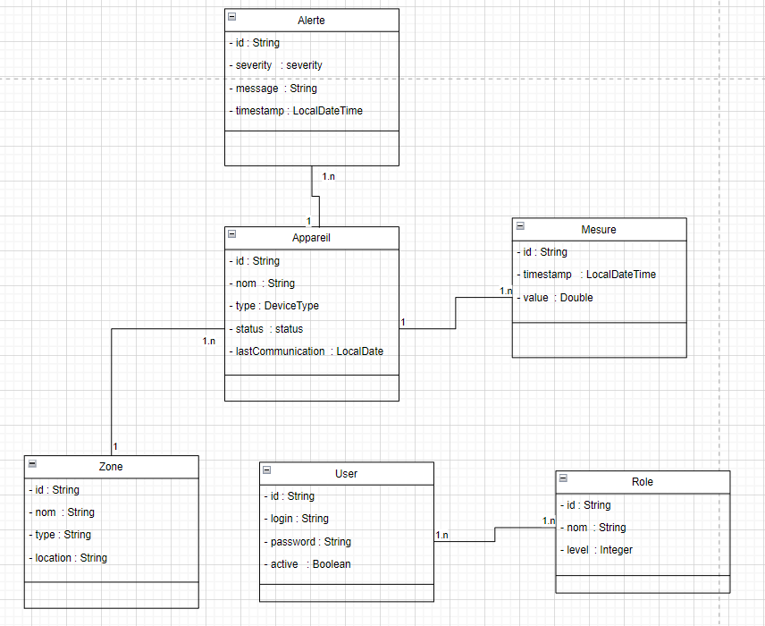

# IoT Device Management API

## Project Context
This project is designed to provide a RESTful API for managing IoT devices, measurements, and alerts. The API includes secure stateless authentication and supports different access levels (USER/ADMIN). It is built with **Spring Boot** and follows modern **DevOps** practices.

---
## UML Diagram
Below is the UML diagram representing the system's main entities and relationships:



## Core Entities

### 1. **Device**
- **Attributes**:
    - `name` (String)
    - `type` (DeviceType)
    - `status` (enum: ACTIVE, INACTIVE)
    - `lastCommunication` (LocalDateTime)

### 2. **Measurement**
- **Attributes**:
    - `timestamp` (LocalDateTime)
    - `value` (Double)

### 3. **Alert**
- **Attributes**:
    - `severity` (enum: NORMAL, LOW, MEDIUM, HIGH, CRITICAL)
    - `message` (String)
    - `timestamp` (LocalDateTime)

### 4. **Zone**
- **Attributes**:
    - `name` (String)
    - `type` (String)
    - `location` (String)

### 5. **User**
- **Attributes**:
    - `login` (String)
    - `password` (String)
    - `active` (Boolean)
    - `roles` (Collection)

### 6. **Role**
- **Attributes**:
    - `name` (String)
    - `level` (Integer)

---

## Relationships
- A **Device** belongs to a **Zone**.
- A **Zone** contains multiple **Devices**.
- A **Device** can have multiple **Measurements**.
- A **Device** can generate multiple **Alerts**.

---

## Device Types
### Temperature Sensor
- **CRITICAL**: > 40°C or < -10°C (Immediate risk to equipment)
- **HIGH**: 35-40°C or -5°C to -10°C (Requires quick action)
- **MEDIUM**: 30-35°C or 0°C to -5°C (Monitor closely)
- **LOW**: 25-30°C (Slight deviation from optimal range)
- **NORMAL**: 20-25°C (Optimal range)

### Humidity Sensor
- **CRITICAL**: > 90% or < 20% (Risk of material damage)
- **HIGH**: 80-90% or 20-30% (Unfavorable conditions)
- **MEDIUM**: 70-80% or 30-40% (Monitor closely)
- **LOW**: 65-70% or 40-45% (Slight deviation)
- **NORMAL**: 45-65% (Optimal range)

---

## API Features

### Device Management
- **USER/ADMIN**:
    - List all devices with pagination.
    - Search devices by zone with pagination.
- **ADMIN**:
    - Add a new device.

**Endpoints**:
- `/api/user/devices/**`
- `/api/admin/devices/**`

### Zone Management
- **USER/ADMIN**:
    - View a zone.
- **ADMIN**:
    - Add a new zone.

**Endpoints**:
- `/api/user/zones/**`
- `/api/admin/zones/**`

### Measurement Management
- **USER/ADMIN**:
    - View all measurements.
    - Record a new measurement.
    - Export measurements.
    - View device measurements with pagination.

**Endpoints**:
- `/api/user/measurements/**`
- `/api/admin/measurements/**`

### Alert Management
- **USER/ADMIN**:
    - View all alerts.

**Endpoints**:
- `/api/user/alerts/**`
- `/api/admin/alerts/**`

### User Management
- **USER**:
    - Authenticate (`/api/auth/login`).
    - Register (`/api/auth/register`).
- **ADMIN**:
    - View all users.
    - Manage user roles.

**Endpoints**:
- `/api/auth/login`
- `/api/auth/register`
- `/api/admin/users`
- `/api/admin/users/{id}/roles`

---

## Security
- Implemented with **Spring Security**.
- Stateless authentication using **JWT**.
- Role-based access control:
    - `/api/admin/**` requires the `ADMIN` role.
    - `/api/user/**` requires the `USER` role.
- Password encryption with **BCryptPasswordEncoder**.

---

## Containerization with Docker
- **Dockerfile**:
    - Custom scripts for startup.
    - Generate Docker images with Jenkins and push to DockerHub.
- **Code Quality**:
    - Use **SonarLint** for local code checks.
- **Monitoring**:
    - Integrated **Spring Actuator** for application health monitoring.

---

## Continuous Integration and Quality Assurance
- **Jenkins**:
    - Build pipelines for automated testing, packaging, and deployment.
- **SonarLint**:
    - Ensure high code quality standards.

---

## Getting Started

### Prerequisites
- **Java 8** or later.
- **Spring Boot** (version 2.7+).
- **Docker** (latest version).
- **Jenkins** for CI/CD pipelines.

### Steps to Run
1. Clone the repository:
   ```bash
   git clone https://github.com/SupervisionDesCapteurs/Plateforme_IoT
